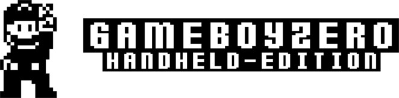
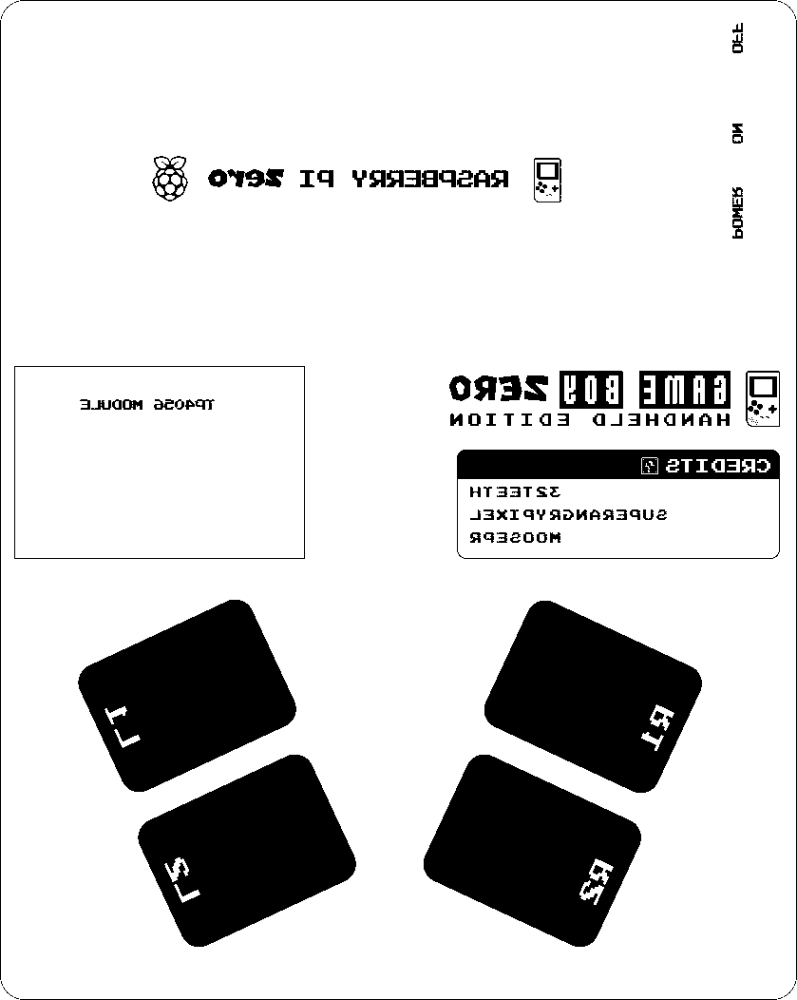

# Gameboy Zero

> Looking for a no frills multi system emulator that fits in your pocket? Look no further! This is it, Gameboy Zero - Handheld Edition!!!
> This project is a collaboration between  [moosepr](https://github.com/moosepr/) and  [32teeth](https://github.com/32teeth)
> We are **live** on [KickStarter](https://www.kickstarter.com/projects/sparky/gameboy-zero-handheld-edition)
> Thank you everyone for your support.


|                                          |                                          |
| ---------------------------------------- | ---------------------------------------- |
|  |  |

## Introduction

### Gameboy Zero - Handheld Edition
Raspberry Pi Zero based arcade in you pocket

### Features:
* 2.8" TFT LCD
* Gameboy button layout interface
* Raspberry Pi Zero
* Battery Charger
* Shoulder / Trigger buttons
* 60 frames per second display

### Platforms:
The boards have been tested with the following platforms:

- [x] [Emulation Station](http://www.emulationstation.org/)
- [ ] [Lakka](http://www.lakka.tv/)
- [x] [RetroPie](https://retropie.org.uk/)

Other platforms are yet to be tested.


#### Eagle CAD Library

With our project we have included a few custom Eagle CAD Libraries

* [Displays](/library/GameboyZeroHandheldDisplays.lbr)
* [Raspberry Pi Zero](/library/RPI-Zero.lbr)


## Details

| Screen Size | Version | Top                                      | Bottom                                   |
| ----------- | ------- | ---------------------------------------- | ---------------------------------------- |
| 2.8"        | Pi Zero |  |  |

## Custom Silk Screen
if you plan on changin the silk design,
* use the [gameboyzero sketch](design/gameboyzero) file
* all fonts required are in the  [fonts folder](fonts/)
* export groups (either 'top' or 'bottom' as JPG)

*converting jpg to 2 color bitmap*
```shell
# imagemagick is required brew package
$ brew install imagemagick

# convert (replace with your file names and outputs)
# ex: convert "gameboyzero-top.jpg" -depth 1 -monochrome -colors 2 "gameboyzero-top.bmp"
$ convert "[jpg to convert]"  depth 1 -monochrome -colors 2 "[bmp to output]"
```

#### Import bmp in Eagle CAD.
* change scale type to *mm*
* change scale to *0.08455*
* place it on layer 200
* hide all your layers except 200
* select everything
* change group to layer 21 (tPlace) or 22 (bPlace)
* move group *(if needed)*

## Custom Config
> If you do not plan on using the provided Raspberry Pi image, simply [download](https://retropie.org.uk/download/) the latest RetroPie pre made image for the Raspberry Pi Zero

Once you have installed RetroPie onto your SD card and mounted it on your Pi follow along with the [Installation Instructions](INSTALL.md) document provided
